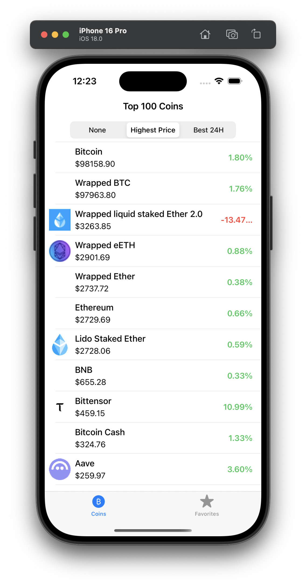
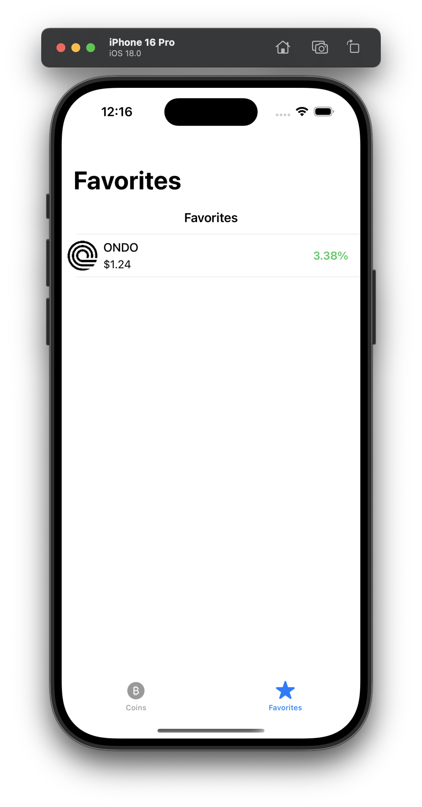
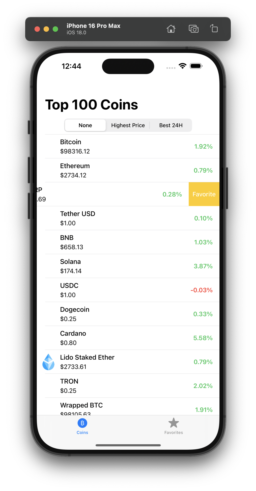
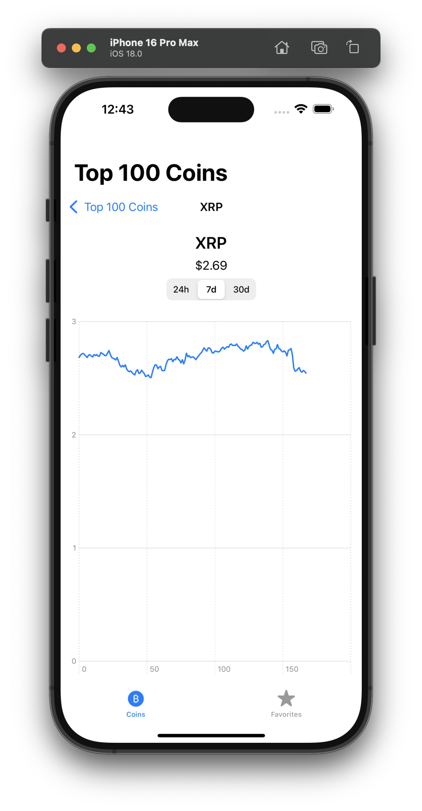
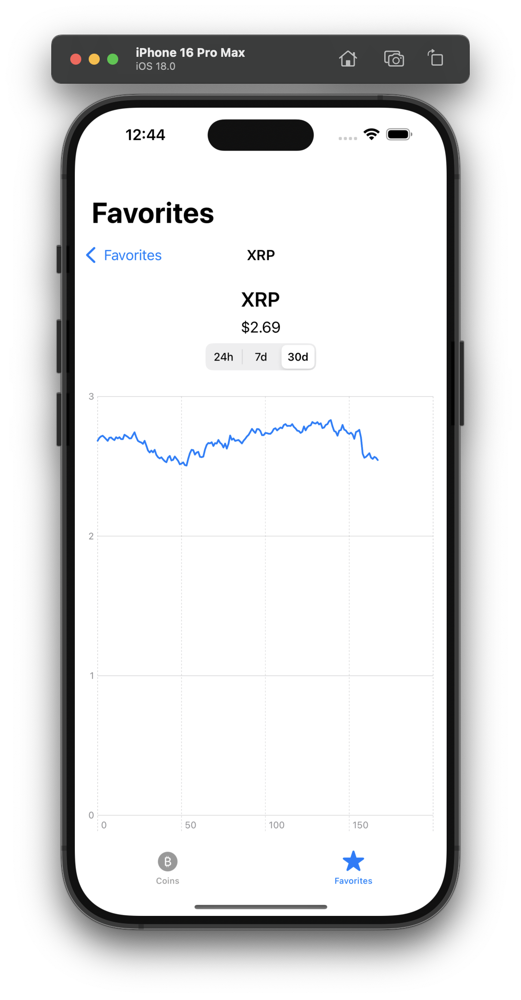

# CryptoApp

An iOS application that shows the top 100 coins from the CoinRanking API, demonstrates pagination (20 coins per page), swipe-to-favorite functionality, filtering, a detail screen with a chart, and a favorites screen.

## Requirements

- iOS 16.0+
- Xcode 14.0+
- Swift 5+

## Building and Running

1. Create or open a new SwiftUI iOS project in Xcode.
2. Copy all of the provided files into your project structure.
3. Replace `YOUR_COINRANKING_API_KEY` in `NetworkManager.swift` with your CoinRanking API key.
4. Make sure your iOS Deployment Target is 16.0 or higher (required for SwiftUI Charts).
5. Build and run the app on a simulator or device.

## Assumptions / Decisions

- Used `UserDefaults` to store favorite coin IDs.
- The "detail" screen is a UIKit `UIViewController` that uses a SwiftUI `PerformanceChartView` inside a `UIHostingController`.
- Minimal error handling for demonstration purposes.
- Filtering is done in-memory after data is fetched.
- Basic `XCTest` coverage for networking and favorites logic.

## Challenges & Solutions

- **Pagination**: Achieved by incrementing `offset` in 20-coin increments up to 100 coins total.
- **Hybrid UI**: The main app uses SwiftUI (`@main struct`), but coin lists and detail views use UIKit. We embed these UIKit controllers in SwiftUI using `UIViewControllerRepresentable`.
- **Performance Chart**: Used SwiftUI’s `Charts` framework. For older iOS versions, consider a 3rd-party chart library.

## Screenshots

Below are some sample screenshots showcasing the **Top 100 Coins** screen and the **Favorites** screen:

### Top 100 Coins

### Favorites Screen

### Swipe for favorites in Home Page

### Details from Home Page

### Details from Favorites Page

## Tests

Run the included unit tests (in `CryptoAppTests.swift`) via **Product → Test** or **Cmd + U** in Xcode.
